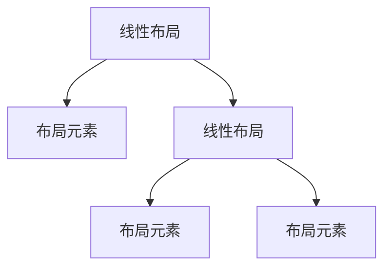
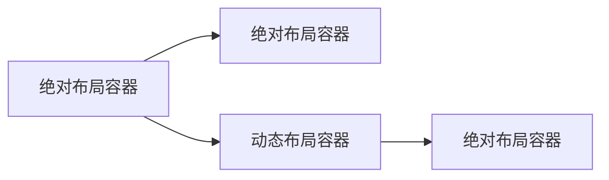
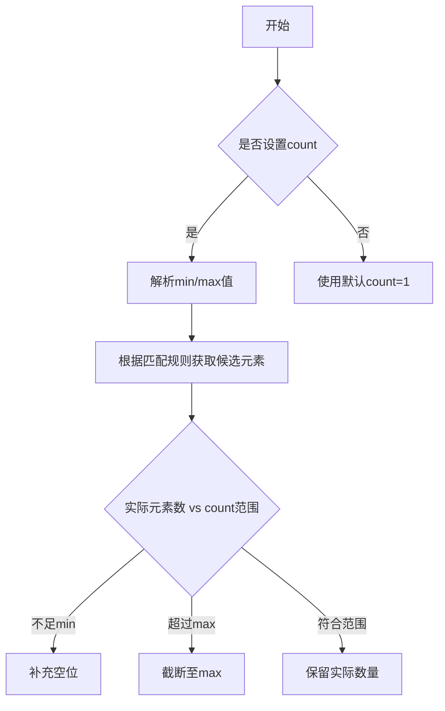
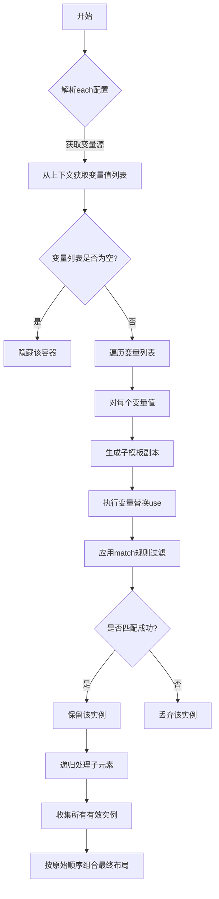
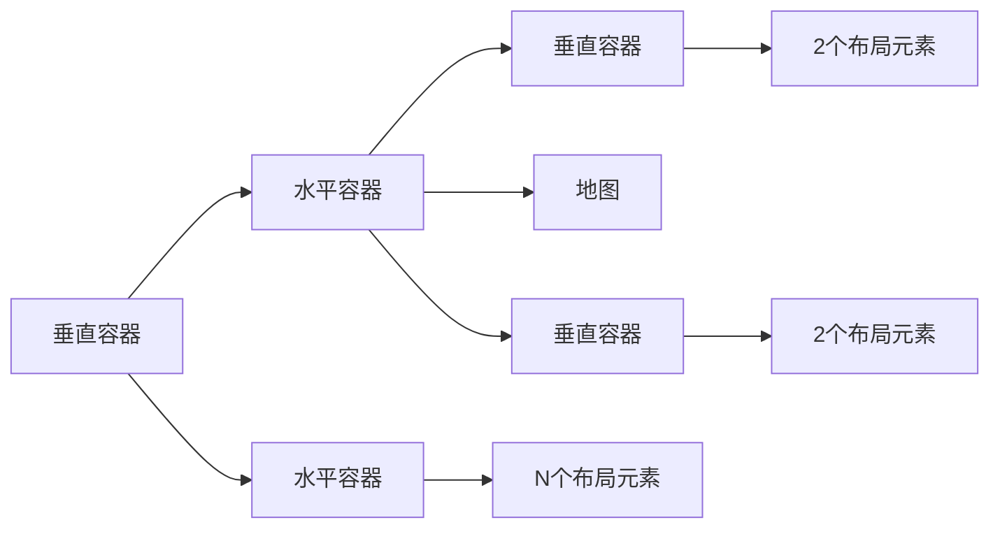

# 智能看板布局系统设计方案

- [智能看板布局系统设计方案](#智能看板布局系统设计方案)
  - [一、项目背景与目标](#一项目背景与目标)
  - [二、核心设计概念](#二核心设计概念)
    - [1. 布局容器系统](#1-布局容器系统)
    - [2. 布局策略](#2-布局策略)
    - [3. 双标签体系](#3-双标签体系)
  - [三、关键技术方案](#三关键技术方案)
    - [1. 响应式布局策略](#1-响应式布局策略)
    - [2. 智能匹配规则](#2-智能匹配规则)
    - [3. 绝对定位布局机制](#3-绝对定位布局机制)
    - [4. 动态布局机制](#4-动态布局机制)
      - [a). Count 模式](#a-count-模式)
      - [b). Each 模式](#b-each-模式)
      - [c). Count 与 Each 的差异对比](#c-count-与-each-的差异对比)
  - [四、实际应用案例](#四实际应用案例)
    - [问题：南京今年售电量](#问题南京今年售电量)

> 默认大部分情况下，系统会根据分析树的结构，自适应生成看板布局。但也提供了布局模板的定制能力。

**——灵活、动态、可配置的布局生成引擎**

---

## 一、项目背景与目标

1. **业务需求**：应对多维度（地市、行业等）、多主题（电量/电价/电费）的动态分析场景  
2. **技术挑战**：  
   - 如何实现布局模板化配置？  
   - 如何适配不同图表类型与屏幕尺寸？  
3. **设计目标**：  
   - ✅ 支持动态数据驱动布局生成  
   - ✅ 实现业务标签与技术标签解耦  
   - ✅ 提供灵活的布局嵌套与组合能力  

---

## 二、核心设计概念

**布局执行逻辑**

### 1. 布局容器系统

| 布局类型     | 作用               | 示例                   |
| -------- | ---------------- | -------------------- |
| **线性布局** | 精确控制布局方向（水平或者垂直） | `布局类型=LinearLayout`  |
| **布局元素** | 布局容器呈现元素         | `布局类型=AnalysisPoint` |



### 2. 布局策略

| 布局策略     | 作用       | 典型场景         |
| -------- | -------- | ------------ |
| **绝对布局** | 精确控制元素位置 | 需要严格控制       |
| **动态布局** | 自动适配数据变化 | 需要以数据驱动的镜像元素 |

**互相嵌套混用使用场景**： 



### 3. 双标签体系

| 标签类型     | 作用        | 示例                                    |
| -------- | --------- | ------------------------------------- |
| **业务标签** | 确定分析维度与主题 | `业务=售电量` `分析维度=行业大类`                  |
| **技术标签** | 控制可视化呈现   | `布局方向=Horizontal` `图形大小=M` `图表类型=柱状图` |

---

## 三、关键技术方案

### 1. 响应式布局策略

| 维度     | 配置方式           | 典型场景 |
| ------ | -------------- | ---- |
| **宽度** | 分数占比（1/3）或自动平分 | 多列布局 |
| **高度** | S/M/L/XL分级配置   | 滚动展示 |

### 2. 智能匹配规则

- **多级条件匹配**：  

```json
"match": {
    "chart_type": {"$in": ["RegionMap"]}
}
```

### 3. 绝对定位布局机制

**核心逻辑**：  直接指定 children 里面的每个位置的分析点。

```json
"template": {
    "type": "LinearLayout",
    "orientation": "Horizontal",
    "children": [
        {
            "type": "LinearLayout",
            "orientation": "Vertical",
            "view": {"width": "1/3"},
            "children": [
                {
                    "type": "AnalysisPoint",
                    "view": {"height": "S"},
                    "match": {
                        "chart_type": {"$in": ["TextCard"]}
                    }
                },
                {
                    "type": "AnalysisPoint",
                    "view": {"height": "S"},
                    "match": {
                        "chart_type": {"$in": ["TextCard"]}
                    }
                }
            ]
        },
        {
            "type": "AnalysisPoint",
            "view": {"height": "M"},
            "match": {
                "chart_type": {"$not": {"$in": ["TextCard"]}}
            }
        }
    ]
}
```

### 4. 动态布局机制

#### a). Count 模式

**核心逻辑**： 通过 `count` 属性可以实现从「严格固定布局」到「弹性布局」的平滑过渡，与 `match` 规则配合使用以达到最佳动态效果。

| 属性    | 值格式         | 说明                 |
| ----- | ----------- | ------------------ |
| count | "[min,max]" | 控制容器内元素数量范围或固定数量配置 |

特殊值说明

| 符号  | 含义     | 示例      | 适用场景   |
| --- | ------ | ------- | ------ |
| n   | 表示无上限  | "[3,n]" | 横向滚动容器 |
| 数字  | 具体数量限制 | "[2,4]" | 固定布局模块 |

```json
"template": {
    "type": "LinearLayout",
    "orientation": "Horizontal",
    "children": [
        {
            "type": "AnalysisPoint",
            "view": {"height": "M"},
            "count": "[1,3]", // 允许1-3个元素
        }
    ]
}
```

无限滚动容器

```json
"template": {
    "type": "LinearLayout",
    "orientation": "Horizontal",
    "view": {"items_wrap": "wrap"},  // 自动换行，指定该容器内的元素实现自适应
    "children": [
        {
            "type": "AnalysisPoint",
            "view": {"height": "M"},
            "count": "[0,n]",  // 允许任意数量（根据数据自动生成）
        }
    ]
}
```

执行逻辑



#### b). Each 模式

**核心逻辑**：`each` 遍历 + `use` 变量替换

```json
"template": {
    "type": "LinearLayout",
    "orientation": "Horizontal",
    "each": {"city": "地域单位"},  // 遍历地域单位维度
    "children": [
        {
            "use": ["$city"],  // 动态替换变量
            "type": "AnalysisPoint",
            "view": {"height": "L"},
            "match": {"is_persona": true}  // 匹配画像分析
        }
    ]
}
```

执行逻辑



#### c). Count 与 Each 的差异对比

| 特性        | count        | each     |
| --------- | ------------ | -------- |
| **动态机制**  | 数量控制         | 数据遍历     |
| **数据依赖**  | 不依赖外部变量      | 需要 `use` |
| **布局生成**  | 按数量复制模板      | 按变量值展开模板 |
| **典型场景**  | 指标卡数量控制、固定模块 | 多维度数据对比  |
| **配置复杂度** | ★★☆☆☆        | ★★★☆☆    |

---

## 四、实际应用案例

### 问题：南京今年售电量

**生成过程**：  

1. 解析绝对布局 
2. 解析 `count` 遍历生成布局元素  
3. 动态注入分析模块  

**效果展示**：  


